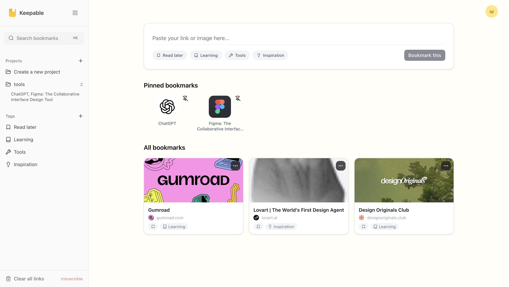

# 📌 Keepable

**Keepable** is a modern web application to **save, organize, and tag links or notes** effortlessly.
It helps you keep everything you care about in one place — structured by **projects**, **tags**, and **pinned items** for quick access.

> Built with **Next.js**, **shadcn/ui**, **Framer Motion**, and a clean, minimal UI.

---

## ✨ Features

- 🔖 **Save links & notes** with rich previews
- 🏷 **Tag-based organization** (Read later, Learning, Tools, Inspiration, etc.)
- 📁 **Projects (Folders)** to group related bookmarks
- 📌 **Pin important bookmarks** to the top
- 🔍 **Search bookmarks instantly**
- 🗑 **Clear All links** (removes all saved links while keeping tags and projects)
- 💾 **Local storage persistence** (data stays after refresh)
- ⚡ **Fast & responsive UI**
- 🎨 Smooth animations using Framer Motion

---

## 🖼 Preview



---

## 🛠 Tech Stack

- **Framework**: Next.js (App Router)
- **UI Components**: shadcn/ui
- **Styling**: Tailwind CSS
- **Animations**: Framer Motion
- **State Persistence**: LocalStorage
- **Icons**: Lucide Icons
- **Notifications**: Sonner
- **Storage**: LocalStorage with structured data

---

## 🚀 Getting Started

### 1️⃣ Clone the repository

```bash
git clone https://github.com/Arjunbr121/keepable.git
cd keepable
```

---

### 2️⃣ Install dependencies

```bash
npm install
```

---

### 3️⃣ Run the development server

```bash
npm run dev
```

Open your browser at:

```
http://localhost:3000
```

---

## 🧠 How It Works

- Paste a **link or note** into the input field
- Add **tags** before saving
- Organize bookmarks into **projects**
- **Pin** frequently used links
- Search or filter anytime
- All data is saved locally in your browser

---

## 📦 Folder Structure (High-level)

```
keepable/
├── public/
│   ├── file.svg
│   ├── globe.svg
│   ├── logo.svg
│   ├── next.svg
│   ├── vercel.svg
│   └── window.svg
│
├── src/
│   ├── app/
│   │   ├── components/
│   │   │   └── SideBar/
│   │   │       └── AppSidebar.tsx
│   │   │
│   │   ├── Pages/
│   │   │   └── KeepablePage/
│   │   │       └── KeepablePage.tsx
│   │   │
│   │   ├── favicon.ico
│   │   ├── globals.css
│   │   ├── layout.js
│   │   └── page.js
│   │
│   ├── components/
│   ├── hooks/
│   └── lib/
│
├── .gitignore
├── components.json
├── eslint.config.mjs
├── jsconfig.json
├── next-env.d.ts
├── next.config.mjs
├── package.json
├── package-lock.json
├── postcss.config.mjs
└── README.md

```

---

## 🌐 Live Demo

👉 **Live App:**
[https://keepable-o2pi.vercel.app/](https://keepable-o2pi.vercel.app/)

---

## 🔌 Chrome Extension (Optional)

Keepable also has a **Chrome Extension** that opens the app instantly from the browser toolbar.

- One-click access to Keepable
- Perfect for saving links while browsing

_(Extension publishing in progress)_

---

## 🔮 Future Enhancements

- 🔐 User authentication
- ☁️ Cloud sync (Supabase / Firebase)
- 📝 Rich-text notes
- 🗂 Nested folders
- 🔄 Import / Export bookmarks
- 📱 PWA support
- 🤝 Team collaboration
- 🌐 Multi-device sync
- 📱 Mobile-friendly responsive design
- 🎨 Dark mode support
- 🌙 Auto-switch between light/dark themes
- 🎨 Customizable themes

---

## 🤝 Contributing

Contributions are welcome!

1. Fork the repository
2. Create a new branch
3. Make your changes
4. Submit a pull request

---

## 🙌 Acknowledgements

- Next.js team
- shadcn/ui
- Framer Motion
- Lucide Icons
- Vercel

---
